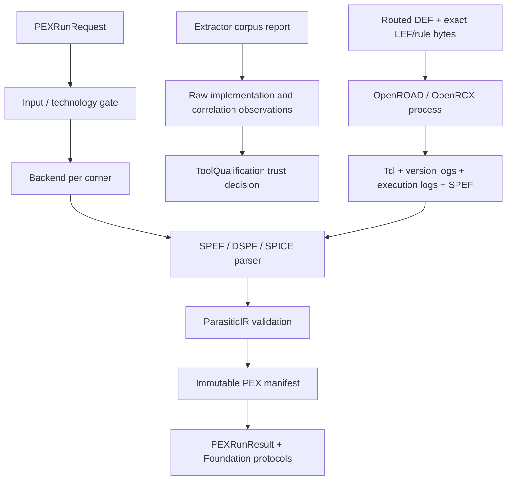

# PEXEngine Design Contract

## Responsibility

PEXEngine validates extraction requests, resolves technology and process
profiles, executes one or more extraction backends, parses output into
canonical `ParasiticIR`, validates the IR, and retains immutable run artifacts
and lineage.

## Foundation integration

`PEXExecuting` refines `CircuiteFoundation.Engine` with
`PEXRunRequest`/`PEXRunResult`; `DefaultPEXEngine.execute` delegates to the
existing run path. Retry and lineage APIs remain PEX-specific.

`PEXRunResult` directly maps available `PEXArtifactManifest` records to
Foundation `ArtifactReference` values, publishes `EvidenceManifest`, and
converts warnings and extractor diagnostics to `DesignDiagnostic`. Its
provenance is derived from the retained backend identity, inputs, and run
timestamps, so no caller-side projection can invent execution identity.

`PEXRunRequest.designObjectReference()` provides a stable top-cell identity;
corner IDs and parasitic nodes remain PEX domain concepts.

## Responsibility boundary

| Concern | Owner |
|---|---|
| Extraction, parsing, IR, corners, retry, lineage | PEXEngine |
| Shared evidence/artifact/provenance contracts | CircuiteFoundation |
| Project state, flow gates, human approval | Xcircuite / DesignFlowKernel |

Foundation evidence is an interchange boundary, not a replacement for the
PEX manifest or the canonical parasitic IR.

## OpenRCX execution contract

`OpenRCXPEXAdapter` directly implements `PEXExtracting`. It does not convert
GDSII/OASIS to DEF or infer PDK views. The request must supply routed DEF,
technology LEF, one or more library LEFs, and the selected corner's OpenRCX
rules. The orchestrator captures every declared view into the immutable run
before execution; resume resolves and verifies those captured bytes.

The process boundary is `TimedProcessRunning`, which owns timeout,
cancellation, and process-tree cleanup. PEX retains the generated Tcl driver,
version-probe stdout/stderr, extraction stdout/stderr, and any non-empty SPEF
present at failure. A zero-byte SPEF is not an artifact and cannot produce a
successful run.

Before an external extraction starts, the backend hashes the selected
executable and observes its semantic version. It hashes the executable again
after the process completes and rejects any change. The resulting
`PEXBackendExecutionIdentity` retains the producer identifier/version/build,
external invocation, sanitized-environment digest, and platform fingerprint.
All successful corners must report the same producer and executable digest;
otherwise the orchestrator rejects the run instead of merging inconsistent
evidence. Per-corner environment fingerprints may differ because corner decks
and output paths are invocation inputs. The manifest retains every corner invocation, while
`ExecutionProvenance` carries the primary invocation and exact input artifacts.

## Correlation contract

`PEXExtractorCorrelationBuilder` consumes the canonical bytes of one
`PEXExtractorCorpus` and two canonical `PEXExternalExtractorCorpusReport`
values. It derives all SHA-256 identities internally. Both reports must name
different backend IDs, cover the exact corpus case set, preserve coverage tags,
and repeat every corpus expectation and tolerance exactly. The comparison is
passing only when both observations and their difference are within the
declared absolute tolerance. The CLI persists canonical correlation bytes once
and refuses overwrite.

## Observation boundary

`PEXExternalExtractorCorpusReport` names the executing implementation with
`extractorBackendID`. A report records one backend's retained regression corpus;
it does not claim that backend is an oracle.

PEXEngine loads and verifies corpus artifacts, correlates case sets against
common physical bounds, and emits canonical `ArtifactReference` values with raw
measurements. It does not assign trust, accept a tool for production, approve a
flow gate, or authorize release. Those decisions belong to `ToolQualification`,
`DesignFlowKernel`, and `ReleaseEngine`, respectively.

| Observation | Meaning |
|---|---|
| Same implementation or executable digest | Not an independent comparison |
| Missing or changed artifact bytes | Integrity finding |
| Magic primary and Magic comparison | Regression observation only |
| Independent implementations and correlated reports | Input for ToolQualification evaluation |
