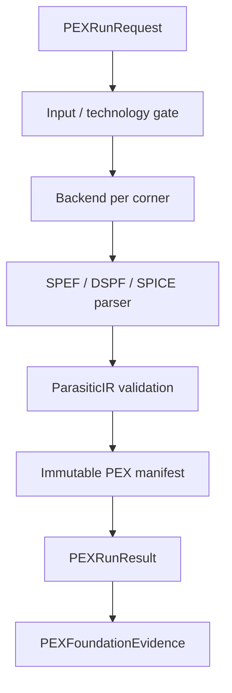

# PEXEngine Design Contract

## Responsibility

PEXEngine validates extraction requests, resolves technology and process
profiles, executes one or more extraction backends, parses output into
canonical `ParasiticIR`, validates the IR, and retains immutable run artifacts
and lineage.

## Foundation integration

`PEXEngineProtocol` refines `CircuiteFoundation.Engine` with
`PEXRunRequest`/`PEXRunResult`; `DefaultPEXEngine.execute` delegates to the
existing run path. Retry and lineage APIs remain PEX-specific.

`PEXFoundationEvidence` maps available records from `PEXArtifactManifest` to
Foundation `ArtifactReference` values. It validates record status, SHA-256,
byte count, relative location, kind, and format. PEX warnings and extractor
diagnostics become typed `DesignDiagnostic` values. The result's run
provenance is supplied by the caller so the Foundation layer cannot invent
tool identity or execution timestamps.

`PEXRunRequest.designObjectReference()` provides a stable top-cell identity;
corner IDs and parasitic nodes remain PEX domain concepts.

## Responsibility boundary

| Concern | Owner |
|---|---|
| Extraction, parsing, IR, corners, retry, lineage | PEXEngine |
| Shared evidence/artifact/provenance contracts | CircuiteFoundation |
| Project state, flow gates, human approval | Xcircuite / DesignFlowKernel |

Foundation evidence is an interchange boundary, not a replacement for the
PEX manifest or the canonical parasitic IR.
