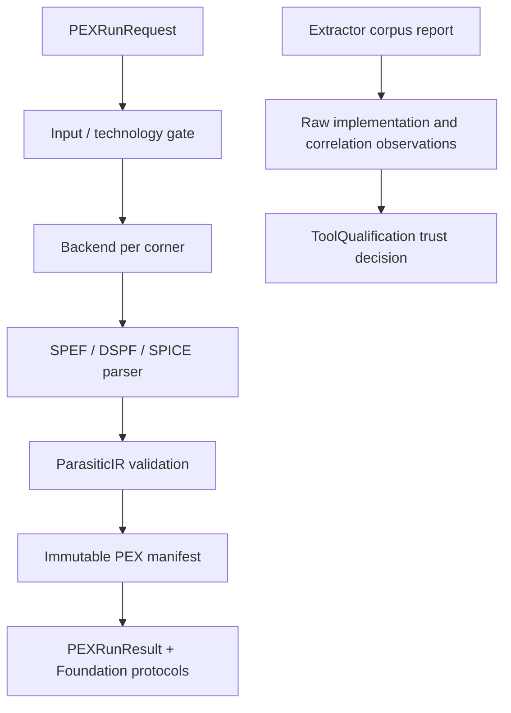

# PEXEngine Design Contract

## Responsibility

PEXEngine validates extraction requests, resolves technology and process
profiles, executes one or more extraction backends, parses output into
canonical `ParasiticIR`, validates the IR, and retains immutable run artifacts
and lineage.

## Foundation integration

`PEXExecuting` refines `CircuiteFoundation.Engine` with
`PEXRunRequest`/`PEXRunResult`; `DefaultPEXEngine.execute` delegates to the
existing run path. Retry and lineage APIs remain PEX-specific.

`PEXRunResult` directly maps available `PEXArtifactManifest` records to
Foundation `ArtifactReference` values, publishes `EvidenceManifest`, and
converts warnings and extractor diagnostics to `DesignDiagnostic`. Its
provenance is derived from the retained backend identity, inputs, and run
timestamps, so no caller-side projection can invent execution identity.

`PEXRunRequest.designObjectReference()` provides a stable top-cell identity;
corner IDs and parasitic nodes remain PEX domain concepts.

## Responsibility boundary

| Concern | Owner |
|---|---|
| Extraction, parsing, IR, corners, retry, lineage | PEXEngine |
| Shared evidence/artifact/provenance contracts | CircuiteFoundation |
| Project state, flow gates, human approval | Xcircuite / DesignFlowKernel |

Foundation evidence is an interchange boundary, not a replacement for the
PEX manifest or the canonical parasitic IR.

## Observation boundary

`PEXExternalExtractorCorpusReport` names the executing implementation with
`extractorBackendID`. A report records one backend's retained regression corpus;
it does not claim that backend is an oracle.

PEXEngine loads and verifies corpus artifacts, correlates case sets against
common physical bounds, and emits canonical `ArtifactReference` values with raw
measurements. It does not assign trust, accept a tool for production, approve a
flow gate, or authorize release. Those decisions belong to `ToolQualification`,
`DesignFlowKernel`, and `ReleaseEngine`, respectively.

| Observation | Meaning |
|---|---|
| Same implementation or executable digest | Not an independent comparison |
| Missing or changed artifact bytes | Integrity finding |
| Magic primary and Magic comparison | Regression observation only |
| Independent implementations and correlated reports | Input for ToolQualification evaluation |
