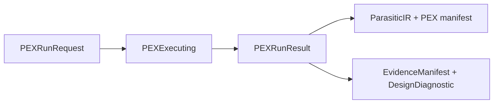

# PEXEngine

## CircuiteFoundation boundary

PEXEngine remains an independent parasitic-extraction engine. It owns backend
execution, SPEF/DSPF/SPICE parsing, canonical `ParasiticIR`, multi-corner
orchestration, and artifact persistence. `CircuiteFoundation` supplies the
shared engine, artifact, evidence, provenance, diagnostics, and design-object
contracts.



`PEXRunResult` directly implements `ArtifactProducing`, `EvidenceProviding`,
and `DiagnosticReporting`. It exposes only available, digest-bearing records;
no wrapper or facade guesses missing integrity data.

## Xcircuite integration

[`Xcircuite`](https://github.com/1amageek/Xcircuite) is the umbrella runtime
that invokes PEXEngine through a PEX flow stage and persists manifests, raw
outputs, canonical `ParasiticIR`, summaries, diagnostics, and retry lineage in
the shared `.xcircuite` run ledger. PEXEngine remains independently usable
through its typed API and `pexengine` CLI; it owns extraction semantics rather
than project orchestration or GUI state.

A Swift package for parasitic extraction (PEX) of semiconductor layouts. PEXEngine orchestrates extraction backends, parses their outputs, and normalizes results into a tool-agnostic canonical IR.

## Features

- **Backend-agnostic pipeline** -- Abstracts extraction tools behind a unified adapter protocol
- **Canonical Parasitic IR** -- Tool-independent representation of resistors, capacitors, coupling capacitors, and inductors
- **SPEF, DSPF, and Magic SPICE parsers** -- Standard parasitic output lowering with unit normalization, SPEF `*INDUC` and DSPF / extracted-SPICE `L*` inductor support, and consistent `PEXRunOptions` filtering
- **Deterministic SPICE backannotation** -- Each successful corner emits a standalone `.cir` subcircuit with all canonical R/C/coupling/L elements and explicit node-map comments; source netlists are not silently rewritten
- **Multi-corner extraction** -- Parallel corner processing with configurable job limits and `extractorRun.multiCorner` worst/spread summaries
- **Real Magic extraction backend** -- Profile-declared Magic/PDK execution produces extracted SPICE and never fabricates parasitics when the toolchain is unavailable
- **Immutable artifact persistence** -- Manifest, raw outputs, normalized IR, and summary reports
- **Typed failure provenance** -- Failed corner manifests retain `PEXErrorKind`, so host flow gates can distinguish unavailable infrastructure from extraction, parsing, validation, and persistence failures
- **Selective retry/resume contract** -- Failed corners can be retried as a new run with `resumedFromRunID` provenance
- **Artifact-only retry CLI** -- `pexengine retry --run <manifest.json>` reconstructs the request from captured inputs and retries failed corners without the original source paths
- **Run lineage view** -- `PEXArtifactStore.loadLineage()` overlays child retry corners on immutable parent results for a complete effective-corner view, including source run IDs and artifact provenance per selected corner
- **Lineage CLI** -- `pexengine lineage --run <manifest.json>` exposes the effective corner statuses, source run IDs, and parent/child run chain
- **Hierarchy-aware SPICE composition** -- `pexengine backannotate` inserts a retained ParasiticIR fragment into a source deck, validates source ports, and preserves the selected `.subckt` boundary
- **Structured source connectivity** -- SPICE/CDL continuation lines and Verilog module ports/basic instance connections are compared against extracted pin nodes with explicit warning states for malformed syntax
- **CLI tool** -- `pexengine` commands for extraction, parsing, validation, diagnostics, summaries, and typed ParasiticIR queries
- **Parser corpus observations** -- OpenROAD OpenRCX SPEF fixtures emit structured, reproducible measurements
- **Observation export** -- Saved parser-corpus reports can be converted into a canonical artifact-backed observation record
- **Configuration via Foundation JSON** -- JSON config with deterministic provider hierarchy (file > defaults)
- **Real-data validation** -- OpenROAD OpenRCX SPEF fixtures and Sky130 back-annotation gates

## Requirements

- Swift 6.3+
- macOS 26+

## Installation

### Swift Package Manager

Add to your `Package.swift`:

```swift
dependencies: [
    .package(url: "https://github.com/1amageek/PEXEngine.git", from: "0.1.0"),
]
```

The current checkout resolves the Magic PDK profile catalog through the sibling
`SignoffToolSupport` package (`../SignoffToolSupport`). A published standalone
distribution must publish that dependency or vendor an equivalent profile
resolver before remote SwiftPM consumers can build the Magic adapter.

Then add the dependency to your target:

```swift
.target(
    name: "YourTarget",
    dependencies: ["PEXEngine"]
),
```

## Architecture

```
PEXRunRequest
    |
    v
[ TechnologyResolver ] --> TechnologyIR
    |
    v
[ PEXExtracting ]         --> PEXRawOutput (SPEF/DSPF/SPICE)
    |
    v
[ PEXParser ]          --> ParasiticIR (canonical)
    |
    v
[ IRValidator ]        --> Validation warnings/errors
    |
    v
[ ArtifactStore ]      --> manifest.json + IR JSON + SPICE/SPEF + reports
    |
    v
PEXRunResult
```

### Modules

| Module | Responsibility |
|---|---|
| **PEXCore** | Domain models, IR types, protocols, typed errors, registries, validation |
| **PEXAdapters** | Production backend integrations (MagicPEXAdapter, MagicToolchain, process execution) |
| **PEXTestSupport** | Test-only synthetic extractor and deterministic fixture generator |
| **PEXParsers** | SPEF lexer / parser / lowering pipeline including `*INDUC`, DSPF lowering including `L*` elements, Magic SPICE parasitic lowering including `L*` elements, and deterministic SPICE backannotation writing |
| **PEXPersistence** | Manifest, workspace layout, IR serializer, artifact store, report generator, run summary builder |
| **PEXRuntime** | Orchestrator (actor), pipeline, technology resolver, config mapper, engine |
| **PEXEngine** | Umbrella module (re-exports all above) |
| **PEXCLICore** | CLI command logic: router, commands, output formatter |
| **PEXCLI** | Thin executable entry point |

### Concurrency Model

- `PEXOrchestrator` is an **actor** for I/O operations and ordered state transitions
- `PEXAdapterRegistry` / `PEXParserRegistry` use **`Mutex<T>`** for synchronous access
- Multi-corner extraction uses **`TaskGroup`** with bounded parallelism
- All data models are **`Sendable`** structs

## Usage

### Library API

```swift
import PEXEngine

// Run extraction
let engine = DefaultPEXEngine.withDefaults()
let request = PEXRunRequest(
    layoutURL: layoutURL,
    layoutFormat: .gds,
    sourceNetlistURL: netlistURL,
    sourceNetlistFormat: .spice,
    topCell: "top",
    corners: [PEXCorner(id: "tt_25c_1v0")],
    technology: .jsonFile(techURL),
    backendSelection: PEXBackendSelection(backendID: "mock"),
    options: .default
)
let result = try await engine.run(request)
let multiCorner = result.extractorRun?.multiCorner

// Retry only failed corners from a retained partial/failed run.
if result.status == .partialSuccess || result.status == .failed {
    let retried = try await engine.retryFailedCorners(request, from: result)
    let parentRun = retried.resumedFromRunID
}

// Query parasitic data
let service = DefaultPEXService.withDefaults()
let summary = try service.queryNet(
    NetName("VDD"),
    runID: result.runID,
    corner: PEXCornerID("tt_25c_1v0"),
    workspace: workspaceURL
)

// Query all nets owned by a hierarchy and compare two persisted corners.
let module = try service.moduleSummary(
    InstancePath("top"),
    runID: result.runID,
    corner: PEXCornerID("tt_25c_1v0"),
    workspace: workspaceURL
)
let delta = try service.cornerDelta(
    runID: result.runID,
    baseCorner: PEXCornerID("tt_25c_1v0"),
    targetCorner: PEXCornerID("ss_125c_0v81"),
    workspace: workspaceURL
)

// LayoutSelection can also carry a process profile, extraction options, and
// an explicit workspace when the host app uses the service facade.
let configuredSelection = LayoutSelection(
    layoutURL: layoutURL,
    netlistURL: netlistURL,
    topCell: "top",
    technologyPath: techURL,
    processProfile: processProfile,
    options: .default,
    workingDirectory: workspaceURL
)

// Build an Agent-readable per-corner run summary from persisted artifacts
let runSummary = try PEXRunSummaryBuilder().build(
    manifestURL: result.manifestURL,
    topNets: 5
)
```

`moduleSummary` treats nodes without hierarchy annotations as root-design
content only when the requested path matches the IR `topCell`/`designName`.
They are never silently attributed to a child instance path.

### CLI

```bash
# Run extraction from config
pexengine extract --config project.json --json

# Run extraction with direct parameters
pexengine extract \
    --layout design.gds \
    --netlist design.sp \
    --top-cell top \
    --technology tech.json \
    --backend mock \
    --corner tt --corner ss \
    --corner-deck tt=/pdk/libs.tech/magic/sky130A-tt.magicrc \
    --corner-deck ss=/pdk/libs.tech/magic/sky130A-ss.magicrc \
    --json

# Use an explicit technology reference for one corner.
pexengine extract \
    --layout design.gds \
    --netlist design.sp \
    --top-cell top \
    --technology sky130A.json \
    --corner-technology ss=sky130B.json \
    --backend mock \
    --corner tt --corner ss \
    --json

# Run extraction and include a persisted per-corner top-net summary in the same JSON response.
# The base JSON response always includes extractorRun.multiCorner when extractorRun is available.
pexengine extract \
    --layout design.gds \
    --netlist design.sp \
    --top-cell top \
    --technology tech.json \
    --backend mock \
    --corner tt --corner ss \
    --summary \
    --summary-top-nets 5 \
    --json

# Retry only failed corners using the parent run's captured inputs.
pexengine retry --run .xcircuite/pex/runs/<run-id>/manifest.json --json

# Compose one retained corner IR into the source deck.
pexengine backannotate \
    --netlist top.cir \
    --ir .xcircuite/pex/runs/<run-id>/ir/tt.json \
    --output .xcircuite/pex/runs/<run-id>/reports/post-tt.cir \
    --top-cell TOP \
    --json

# Inspect the effective result after one or more retries.
pexengine lineage --run .xcircuite/pex/runs/<leaf-run-id>/manifest.json --json

# Parse a SPEF or DSPF file
pexengine parse --input output.spef --corner tt --json
pexengine parse --input output.dspf --format dspf --corner tt --json

# Parse and emit an Agent/developer decision report with validation diagnostics
pexengine parse --input output.spef --corner tt --report --json

# Validate the committed OpenROAD OpenRCX SPEF parser corpus
pexengine parse-corpus \
    --manifest Tests/PEXParsersTests/Fixtures/OpenROAD/fixture-manifest.json \
    --out /tmp/pex-spef-corpus-report.json \
    --json

# Convert a saved parser-corpus report into an artifact-backed observation record
pexengine observation-from-corpus-report \
    --report /tmp/pex-spef-corpus-report.json \
    --json

# Convert a saved parser-corpus report into an Agent-readable evidence packet
pexengine evidence-packet-from-corpus-report \
    --report /tmp/pex-spef-corpus-report.json \
    --out /tmp/pex-evidence-packet.json \
    --json

# Convert a retained real-extractor report into the same evidence packet shape
pexengine evidence-packet-from-extractor-report \
    --report /tmp/pex-real-extractor-report.json \
    --out /tmp/pex-extractor-evidence-packet.json \
    --json

# Validate technology file (strict mode checks layer/via/map semantics, not only JSON shape)
pexengine validate-tech --technology tech.json --strict

# Summarize extraction results
pexengine summarize --run /path/to/run --top-nets 5

# Query retained ParasiticIR without a UI
pexengine query --run /path/to/run --net VDD --corner tt --json
pexengine query --run /path/to/run --module TOP/u1 --corner tt --json
pexengine query --run /path/to/run --base-corner tt --target-corner ss --json

# List available backends
pexengine list-backends --json

# Environment diagnostics
pexengine doctor
```

For a Magic multi-corner run, configure `processProfile.cornerDeckPaths` as a
JSON object keyed by the requested corner IDs, or pass repeatable
`--corner-deck <corner-id>=<deck-path>` flags in direct mode. Each value must be
an existing extraction deck with distinct content; otherwise the run is
rejected as unsupported instead of producing repeated single-deck parasitics.
Distinct bytes are an input-integrity prerequisite, not proof of PVT semantics.
When process decks differ, provide matching `technologyByCorner` references;
this proves process-specific routing, while PVT equivalence still requires
foundry-qualified decks and correlation evidence.
The typed `extractorRun.multiCorner.comparisonBasis` field is
`perCornerTechnology` for this case and `sharedTechnology` when every corner
uses the run-level technology. Agents must inspect this field before treating
the numeric spread as a PVT metric; neither value replaces foundry correlation
evidence. Current persisted manifests must encode the comparison basis
explicitly, and previous manifest schemas are rejected.
The persisted `extractorRun.multiCorner.notes` repeats this distinction for
Agent and human review, so a numerically comparable spread is not mistaken for
a foundry-correlated PVT result.
Paths in a
JSON config are resolved relative to that config file, including `pdkRoot` and
`primaryDeckPath`.

Source-netlist connectivity checking is controlled by
`options.sourceConnectivityPolicy` or `--source-connectivity`. `warn` retains a
per-corner JSON report and warning when extracted pin nodes cannot be matched to
the source SPICE/CDL nodes; `strict` turns that mismatch into a failed corner;
`disabled` omits the check. Verilog module ports, declarations, and basic named
or positional instance connections are parsed structurally; malformed or
unsupported constructs remain an explicit warning rather than a false pass.

### Exit Codes

| Code | Meaning |
|------|---------|
| 0 | Success |
| 1 | Invalid input / usage error |
| 2 | Technology resolution failure |
| 3 | Backend execution failure |
| 4 | Parse / IR validation failure |
| 5 | Persistence / internal failure |

## Canonical IR

The `ParasiticIR` provides a tool-independent representation:

```
ParasiticIR
  +-- nets: [ParasiticNet]
  |     +-- name: NetName
  |     +-- nodes: [ParasiticNode]
  |     +-- totalGroundCapF, totalCouplingCapF, totalResistanceOhm
  +-- elements: [ParasiticElement]
        +-- kind: resistor | capacitor | coupling
        +-- nodeA, nodeB, value
```

All values are normalized to canonical units: Ohm, Farad, micrometer.

## Build & Test

```bash
# Build
swift build

# Run all tests
swift test

# Run specific module tests
swift test --filter PEXCoreTests
swift test --filter PEXParsersTests
swift test --filter PEXCLITests

# CLI verification
swift run pexengine --version
swift run pexengine doctor
```

## Developer CLI Check

For local development, verify the executable boundary before relying on higher-level
flow integration:

```bash
../scripts/check-developer-cli.sh
```

This builds `pexengine`, runs `extract` through the real executable with the mock
backend, verifies that stdout is parseable JSON, checks that the run manifest and
summary artifacts exist, and confirms that unknown CLI arguments fail instead of
being ignored.

When debugging manually, prefer the executable path that SwiftPM built:

```bash
PEX_BIN="$(swift build --show-bin-path)/pexengine"
"$PEX_BIN" extract \
  --layout design.gds \
  --netlist design.sp \
  --top-cell TOP \
  --technology tech.json \
  --backend mock \
  --out /tmp/pex-run \
  --summary \
  --json
```

For failures, check stderr first. Invalid input exits with code `1`; parse or IR
validation failures exit with code `4`. Successful JSON output includes
`manifestURL`, `completeness.status`, `extractorRun`, `extractorRun.multiCorner`,
and optional `summary`.

## Real Data Validation

PEXEngine keeps real extraction outputs in the test resources so parser and IR
lowering regressions are caught without network access.

| Corpus | Source | Gate |
|---|---|---|
| OpenROAD OpenRCX SPEF | `Tests/PEXParsersTests/Fixtures/OpenROAD/fixture-manifest.json` | `SPEFParserTests/openROADRCXFixturesParseAndLowerToExpectedSummaries` |
| OpenROAD OpenRCX SPEF corpus observations | `Tests/PEXParsersTests/Fixtures/OpenROAD/fixture-manifest.json` | `pexengine parse-corpus --manifest ... --out ...` |
| OpenROAD OpenRCX SPEF observation export | Saved parser-corpus report | `pexengine observation-from-corpus-report --report ... --json` |
| OpenROAD OpenRCX PEX evidence packet | Saved parser-corpus report | `pexengine evidence-packet-from-corpus-report --report ... --json` |
| Sky130 Magic extraction | `Tests/PEXRuntimeTests/Fixtures/pex_plate.gds` | `validation/pex-backannotation.sh` and gated Magic adapter tests |
| Sky130 Magic real-extractor regression lane | `Tests/PEXRuntimeTests/Fixtures/ExternalExtractor/pex-magic-corpus.json` | `scripts/run-signoff-qualification.py --external-pex-corpus ...` from the LSI workspace root |
| Sky130 Magic real-extractor evidence packet | Saved `pex-real-extractor-report.json` | `pexengine evidence-packet-from-extractor-report --report ... --json` |

Each OpenROAD fixture records source path, pinned commit, Git blob SHA, SHA-256,
byte count, parse counts including inductor sections, and lowered `ParasiticIR`
totals. The fixture corpus
includes small name-map cases, coupling-heavy pattern cases, and several
hundred-net GCD extractions. It carries the required `pex.extract.openrcx` and
`pex.physical-value` coverage tags, so OpenRCX real-output SPEF remains retained
physical-value evidence instead of a parser-only smoke fixture. The
`parse-corpus` command turns that same corpus into an Agent-readable
observation report with case pass counts, coverage tag counts, required
coverage checks, observed ParasiticIR totals, failure occurrence and kind counts,
structured per-case failures, and raw evaluation measurements. Failed
cases preserve diagnostic categories such as `parse_failure` and
`physical_bound_mismatch` with observed/expected values and suggested actions,
so an Agent can distinguish syntax problems from physical-value bound drift.
The `observation-from-corpus-report` command turns that immutable report into
an `ArtifactReference`-backed JSON record with an observation timestamp,
report SHA-256, measured counts, and finding codes. `ToolQualification` consumes
these raw observations and owns every trust decision. The
`evidence-packet-from-corpus-report` command emits `PEXEvidencePacket`, which
keeps inputs, readiness, normalized views, metrics, diagnostics, confidence, and
decision hints together as Agent-readable decision material without prescribing
the repair flow. `evidence-packet-from-extractor-report` emits the same packet
shape from retained Magic/OpenRCX-style real-extractor reports, separating
extractor readiness from physical-bound mismatch diagnostics so an Agent can
decide whether to inspect the toolchain, the raw artifacts, or the design impact.
The retained Magic extractor lane includes separate `tt` and `ss` case evidence,
RC-network resistance coverage, and a two-corner Sky130 process case. The latter
uses distinct `sky130A`/`sky130B` decks together with explicit
`technologyByCorner` references; the report records deck hashes, technology
artifacts, and a comparable multi-corner summary. This proves process-specific
routing, not PVT equivalence: PVT signoff still requires foundry-qualified corner
decks and correlation data. Magic still declares `supportsCornerSweep=false` for
native sweep, so all physical variation is driven by explicit per-corner profiles.
The report preserves input/output `artifacts` as domain annotations around
CircuiteFoundation `ArtifactReference` values. Locator, role, kind, format,
SHA-256 digest, byte count, and artifact identity therefore have one canonical
representation across PEX evidence, while the report adds only the source field.

### Qualification boundary

An external-extractor corpus report proves regression coverage for the backend
identified by `extractorBackendID`. It is not an independent oracle record by
itself. In particular, a Magic run compared with another Magic run remains a
regression lane and cannot decide production eligibility. PEXEngine emits
artifact-backed reports, physical measurements, implementation identity, and
correlation observations. `ToolQualification` verifies those records and owns
trust decisions; `DesignFlowKernel` owns approval and flow policy.

## Metric Recovery Objective

`pexengine metric-recovery-objective` converts retained PEX evidence into an
Agent-readable planning artifact without depending on a UI or an external flow
wrapper. It accepts `pex-summary`, optional `pex-ir-comparison-report`, optional
post-layout metric report JSON, and optional layout / netlist / technology refs.
The output is `pex-metric-recovery-planning-problem`, a structured artifact with
Foundation `ArtifactReference` inputs, objectives, parasitic hotspots, candidate
action metadata, and verification gates. Unreadable optional inputs are emitted
as diagnostics instead of incomplete artifact references.

```bash
pexengine metric-recovery-objective \
  --summary /tmp/pex-summary.json \
  --comparison /tmp/pex-ir-comparison.json \
  --metric-report /tmp/post-layout-metrics.json \
  --layout /tmp/layout.gds \
  --source-netlist /tmp/source.spice \
  --technology /tmp/pex-tech.json \
  --out /tmp/pex-recovery-planning-problem.json \
  --json
```

The metric report reader intentionally consumes only the fields needed for PEX
recovery decisions, so it can read both post-layout comparison reports and
simulation metric summaries. This keeps PEXEngine independent while still giving
Agent callers enough evidence to decide whether to inspect parasitic hotspots,
adjust layout or sizing, rerun PEX, or rerun the post-layout metric gate.

## Artifact Output

Each extraction run produces immutable artifacts:

```
<run-id>/
  manifest.json          # Run metadata and Foundation artifact payloads
  request.json           # Original request
  inputs/process-profile-decks/ # Immutable copies of declared RC decks
  raw/<corner-id>/       # Backend-native files (SPEF/DSPF/logs)
  ir/<corner-id>.json    # Normalized IR per corner
  spice/<corner-id>.cir # Deterministic SPICE backannotation subcircuit
  reports/summary.md     # Human-readable summary
  reports/source-connectivity/<corner-id>.json
```

`manifest.json` uses `PEXArtifactManifest.currentVersion` (currently version 3)
and is decoded strictly. The canonical package fixture is
`Tests/PEXPersistenceTests/Fixtures/pex-artifact-manifest-v3.json`.

Loading a run reconstructs corner results from the manifest rather than assuming default paths. Successful corners retain their IR, raw output files, log file paths, and extractor multi-corner comparison summaries; failed corners retain raw and log evidence even when no IR artifact exists.

Available manifest entries carry an `ArtifactReference`. Missing and omitted
entries carry an `ArtifactID` plus `ArtifactLocator` declaration, so unavailable
files never masquerade as integrity-verifiable artifacts.

## License

MIT License. See [LICENSE](LICENSE) for details.
